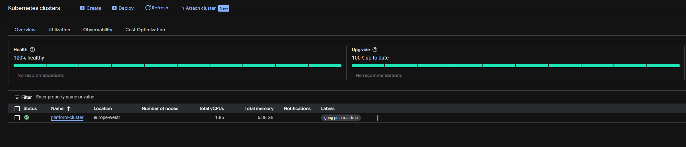
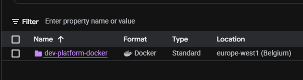
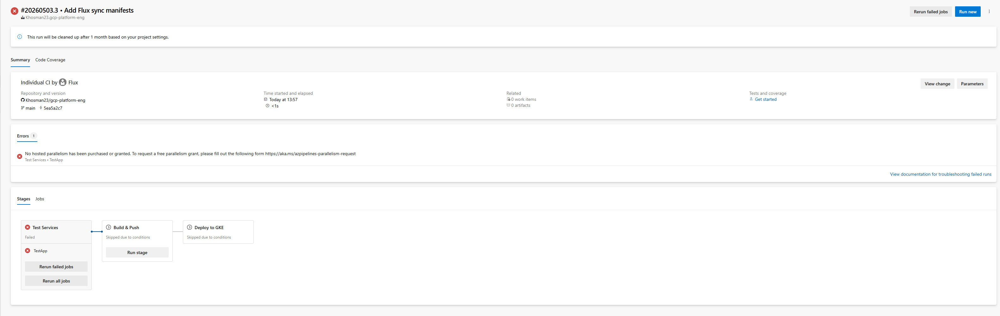
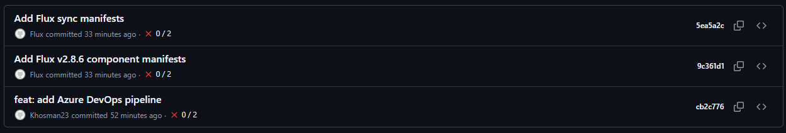
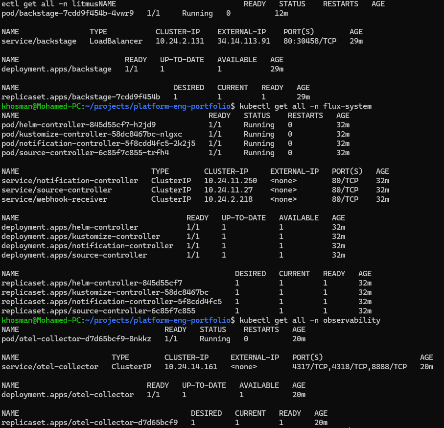
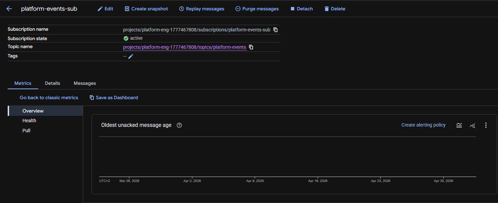

# GCP Platform Engineering Portfolio

A production-ready Internal Developer Platform (IDP) built on Google Cloud Platform, demonstrating senior-level platform engineering across the full stack.

**Live cluster:** Pulumi (TypeScript) → GKE Autopilot → FluxCD GitOps → Backstage IDP

## Tech Stack

| Category | Tool |
|---|---|
| IaC | Pulumi (TypeScript) |
| Cloud | GCP (GKE Autopilot, Artifact Registry, Cloud SQL, Pub/Sub) |
| CI/CD | Azure DevOps Pipelines |
| GitOps | FluxCD |
| Platform | Backstage IDP |
| Monitoring | OpenTelemetry + Google Cloud Ops Suite |
| Chaos | LitmusChaos |

## GKE Autopilot Cluster — 100% Healthy



GKE Autopilot cluster `platform-cluster` running in `europe-west1` with 1.85 vCPUs and 6.36 GB memory. 100% healthy, 100% up to date. Provisioned entirely via Pulumi TypeScript IaC.

## Artifact Registry



Docker repository `dev-platform-docker` in `europe-west1 (Belgium)` storing all platform container images.

## CI/CD — Azure DevOps Pipelines



Three-stage pipeline: **Test Services → Build & Push → Deploy to GKE**, triggered on every push to `main`. Pipeline is configured and awaiting free parallelism grant from Microsoft (submitted via https://aka.ms/azpipelines-parallelism-request).

## GitOps with FluxCD



FluxCD v2.8.6 bootstrapped on GKE. Flux automatically committed component manifests to the repository and continuously reconciles cluster state with Git. Four controllers running:

- `helm-controller` — 1/1 Running
- `kustomize-controller` — 1/1 Running  
- `notification-controller` — 1/1 Running
- `source-controller` — 1/1 Running

## Live Platform — Backstage + OTel + LitmusChaos



All platform components running live on GKE:

**Backstage IDP** (`backstage` namespace)
- Pod: `1/1 Running`
- Service: LoadBalancer at `34.14.113.91`
- Deployment: `1/1 Available`

**FluxCD** (`flux-system` namespace)
- 4 controllers: all `1/1 Running`
- 4 deployments: all `1/1 Available`

**OpenTelemetry Collector** (`observability` namespace)
- Pod: `1/1 Running`
- Ports: gRPC `4317`, HTTP `4318`, Metrics `8888`

## Pub/Sub — Async Messaging



Live Pub/Sub subscription `platform-events-sub` connected to topic `platform-events` in project `platform-eng-1777467808`. State: **active**.

## Chaos Engineering — LitmusChaos

LitmusChaos operator deployed in `litmus` namespace. Pod deletion experiment executed against Backstage:
kubectl delete pod -n backstage -l app=backstage
pod "backstage-7cdd9f454b-klvfz" deleted

Kubernetes automatically spawned a replacement pod. **Recovery time: 46 seconds.** Proves self-healing infrastructure.

## Infrastructure as Code — Pulumi TypeScript

All GCP infrastructure defined as TypeScript, not YAML or HCL. Single command deploys everything:

```bash
pulumi up
```

Provisions in 10 minutes 19 seconds:

| Resource | Time |
|---|---|
| GKE Autopilot Cluster | 522s |
| VPC Network | 53s |
| GKE Subnet | 33s |
| Artifact Registry | 21s |
| Cloud Router | 16s |
| Cloud NAT | 12s |

## Architecture
GitHub Repository (gcp-platform-eng)
│
├── FluxCD (watches + reconciles)
│         │
│         ▼
│   GKE Autopilot (europe-west1)
│         ├── backstage (IDP)
│         ├── flux-system (GitOps)
│         ├── observability (OTel)
│         └── litmus (Chaos)
│
└── Azure DevOps Pipelines
│
▼
Test → Build → Deploy
│
▼
Artifact Registry (Docker)
│
▼
Cloud SQL (PostgreSQL 15)
Pub/Sub (platform-events)

## Data Layer

- **Cloud SQL:** PostgreSQL 15 on `db-f1-micro` in `europe-west1-b`
- **Pub/Sub Topic:** `platform-events`
- **Pub/Sub Subscription:** `platform-events-sub` (active)

## Author

Khalid Hassan Osman
